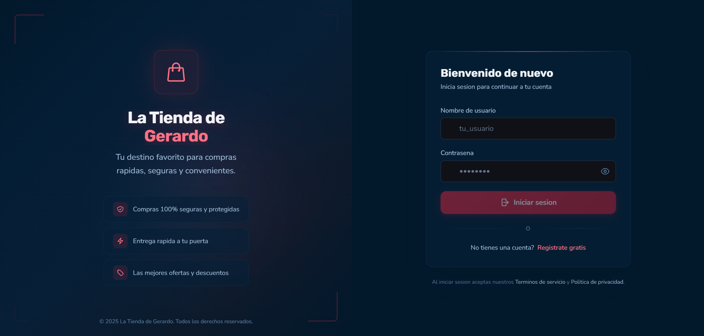
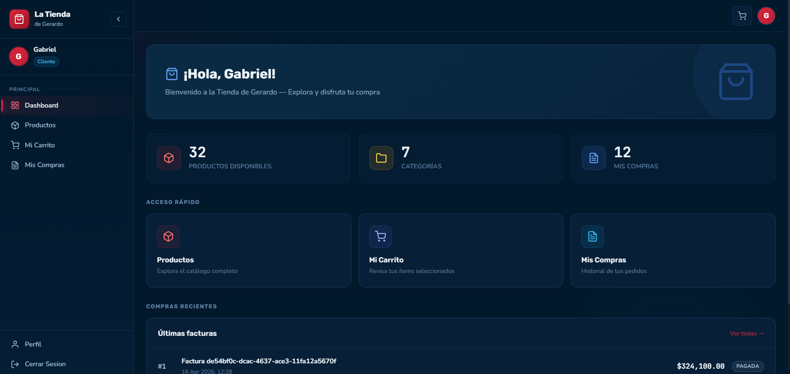

 

**Estudiante de Ingeniería de Sistemas · ITM · Medellín, Colombia 🇨🇴**

*Me gusta entender cómo funcionan las cosas por dentro, no solo hacer que funcionen.*

 

---

## 👨‍💻 Sobre mí

Soy estudiante de Ingeniería de Sistemas en el ITM con enfoque en desarrollo de software. Me muevo bien entre el backend, las bases de datos y el frontend responsivo, siempre intentando construir soluciones limpias y que tengan sentido.

Me autogenero bastante cuando algo no me queda claro en clase, lo investigo, lo pruebo y lo rompo hasta entenderlo. Así aprendo mejor.

Actualmente construyendo proyectos reales con Python, SQL, Angular y ORM mientras avanzo en mi carrera.

---

## 🛠️ Tecnologías

### Manejo bien

### Retomando / profundizando

### Herramientas

---

## 📌 Proyectos destacados

### 🛒 La Tienda de Gerardo &nbsp;
Tienda online construida con Python, SQLAlchemy ORM, PostgreSQL, FastAPI y Angular. Desplegada con Vercel (frontend), Render (backend) y Cloudflare.

🔗 [Ver proyecto en línea](https://frontend-proyecto-tienda-online.vercel.app/)

`Python` · `SQLAlchemy` · `PostgreSQL` · `FastAPI` · `Angular` · `Vercel` · `Render` · `Cloudflare`

### 📸 Capturas de pantalla

| Vista del proyecto |

  
  

---

### ✂️ Sistema de Barbería
Aplicación de escritorio para gestionar clientes, turnos y servicios de una barbería.

`C#` · `.NET`

---

### 🖥️ Sistema de Préstamo de Equipos
App en Java para una institución educativa: asigna computadores a estudiantes de desarrollo y tablets a los de diseño.

`Java` · `POO`

---

### 🏴‍☠️ E-commerce / Blog One Piece
Mi primer proyecto serio, tienda temática con blog, hecha desde cero sin frameworks. De ahí arrancó todo.

`HTML` · `CSS` · `JavaScript`

---

## 📈 Estadísticas de GitHub

---

## 🌱 Aprendiendo ahora

- Arquitecturas con ORM y migraciones en Python
- APIs REST con FastAPI
- Análisis y modelado de sistemas de software
- Fundamentos de Seguridad Informática (ISO 27001, SGSI, CIA)

---

*"El conocimiento que no se aplica no sirve de nada."*

